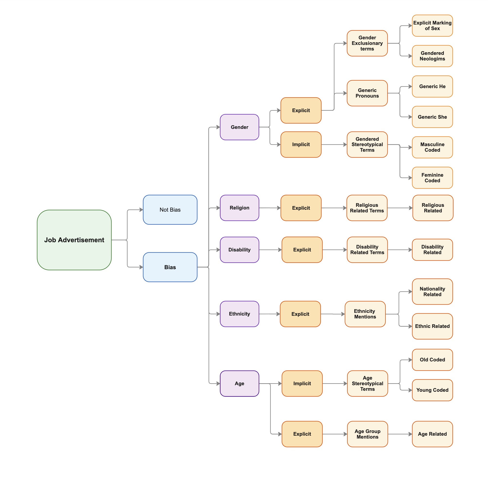
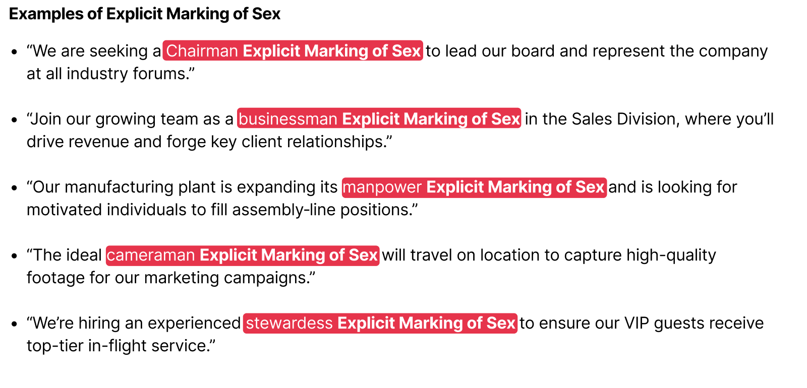
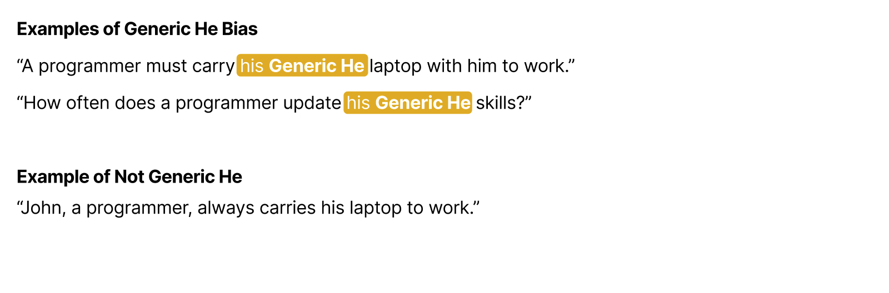
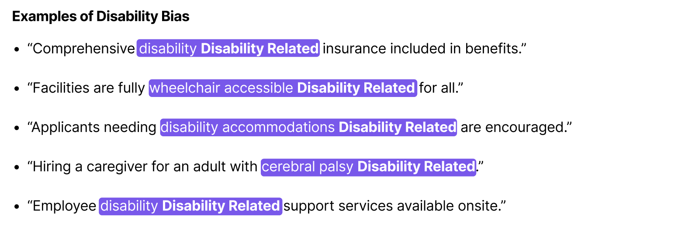
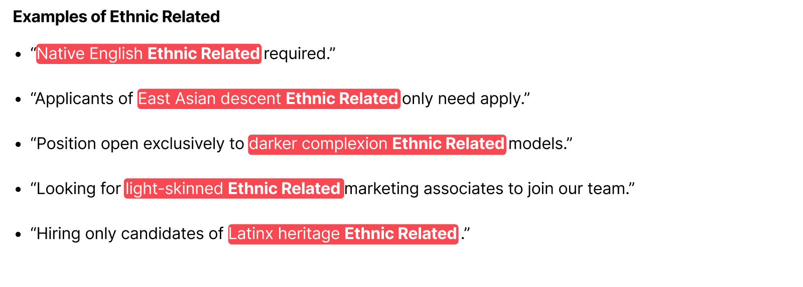

# Type of Biases

In this section there is the definition of every type of bias of this research.

## Explicit Gender Bias {#gender-bias}

### Gender Exclusionary Terms {#gender-exclusionary-terms .unnumbered}

Exclusionary terms occur when a gender-neutral entity is described using gender-exclusive language. For instance, adding a gender-specific sub-word (e.g., "man") to a gender-neutral occupational term (e.g., "police") results in "policeman." This construction implies that all police officers are men, thereby excluding women. Conversely, appending "woman" to "police" to form "policewoman" suggests that all police officers are women. The use of exclusionary terms has been shown to carry negative societal implications. Sex-biased wording can affect perceptions of a career’s attractiveness (Briere and Lanktree, 1983), and languages with gendered occupational terms have been associated with disproportionate labor force participation (Gay et al., 2013).

[**Explicit Marking of Sex**]{style="color: #e93147;"}

The use of explicit sex demarcations in job advertisements constitutes a form of Gender-Exclusive Occupational Terms bias. This category covers instances where an inherently gender-neutral role or occupation is described using a word that unambiguously denotes one gender. Such markings often appear at the word level and clearly signal a specific gender.

 

[**Gendered Neologism**]{style="color: #e9973f;"}

Gendered Neologisms are newly coined, gender-specific terms that are emerging into mainstream usage. Although they share similarities with explicit marking of sex in that they exclude one gender, they differ by virtue of their novelty and evolving acceptance in everyday language. This type of bias is annotated at the word level, as it involves the creation of new exclusionary terms.

Examples: Man-bread, Man-sip, Man-bun, Girlboss, SheEO

### Generic Pronouns {#generic-pronouns .unnumbered}

Pronouns typically correspond to the gender of their referents. However, when the referent is sex-indefinite, the pronoun is used in a generic sense, effectively generalizing gender onto a neutral subject. The most notable form of a generic pronoun sentence occurs when a pronoun’s referent is a sex-indefinite occupation. When a pronoun refers to an occupation rather than a sex-definite person (subject), it becomes generic.

[**Generic He**]{style="color: #e0ac00;"}

Generic He refers to instances where a sex-indefinite role or description is associated with a male pronoun. This use often reflects implicit gender bias by defaulting to a male reference when the subject’s gender is not specified. Due to its dependence on context, this bias is assessed at the sentence level.

[**Generic She**]{style="color: #ec7500;"}

Generic She denotes instances where a sex-indefinite role or description is associated with a female pronoun. This usage may introduce bias by implying that a particular role should be associated with a female perspective when the role itself is gender-neutral. Like Generic He, this bias is evaluated within the context of the sentence.

Example: “A nurse should ensure that she gets adequate rest.”

Not Biased Example: “Jennie is a rapper; her voice is suited for rapping.”

## Implicit Gender Bias

Subtle language choices that suggest a preference for one gender without explicitly naming it. In this instance we will be working mainly with words or sentences that have a strong stereotype associated with a gender in the context of work recruitment.

### Gendered Stereotypical Terms {#gender-stereotypical-terms .unnumbered}

This category covers the inclusion of words or short phrases in job advertisements that carry gender stereotypes. Studies demonstrate that such wording can affect applicants’ attitudes and choices depending on their gender (Gaucher et al, 2011). Since job ads use a formal style, these subtle signals are considered implicit bias.

[**Masculine Coded**]{style="color: #08b94e;"}

Use of words associated with male stereotypes (e.g., "aggressive", "dominant") that subtly signal a male-oriented role or culture. Usually present at word level.

Example: "Looking for an aggressive salesperson to dominate the market."

[**Feminine Coded**]{style="color: #00bfbc;"}

Use of words associated with female stereotypes (e.g., "supportive", "compassionate") that subtly signal a female-oriented role or environment. Usually present at word level.

Example: "Join our compassionate and supportive team.”

## Explicit Religion Bias

### Religious Related Terms {#religion-bias .unnumbered}

Mentions of terms or groups directly and explicitly tied to a religion constitute a bias category in job advertisements, framing the text within a particular religious worldview. Such explicit references can immediately influence potential candidates according to their own beliefs. Although some mentions may be subtle, we treat any reference to a religion or belief system as a single bias class in job postings.

[**Religion Related**]{style="color: #086ddd;"}

Mentions of religion in job advertisements can take many forms—from explicit faith-based requirements to subtle nods toward religious institutions. Regardless of how overt or understated they may be, any word or phrase that references a religion, belief system, or religious organization belongs in this category.

Example: "Only Christian candidates will be considered." Example: “In the church we are looking for an executive assistant”

## Explicit Disability Bias

### Disability Related Terms {#disability-bias .unnumbered}

This category covers any words or phrases in job advertisements that reference disability—whether it’s explicit benefits (e.g., “disability insurance”) or non-discrimination clauses for candidates with impairments. Although most of these statements are intended as positive accommodations, they still influence how applicants with disabilities perceive and respond to the opportunity. Therefore, any mention of disability in a job posting is treated as a single bias class, since it can alter candidates’ behavior and expectations.

[**Disability Related**]{style="color: #7852ee;"}

Terms reflecting disability bias might be as brief as the word “disability” or as elaborate as outlining specific conditions. You can find this bias in any section of a job ad.

## Explicit Ethnicity Bias

### Ethnicity Mentions {#ethnicity-bias .unnumbered}

This category covers any unambiguous mention of ethnicity in a job posting, whether in the company name, candidate requirements, or descriptive phrases. Such explicit ethnic references—like insisting on a specific nationality or calling out a particular heritage—can significantly influence who applies, so we define them as biased. While many attributes can signal ethnicity, this study focuses on two main types: nationality and other ethnic related terms. Keep in mind that any religious references should be classified under Explicit Religion Bias rather than here.

[**Nationality Related**]{style="color: #d53984;"}

Within the broader category of ethnic biases, we spotlight nationality bias because it frequently appears in job ads. Nationality bias includes any explicit reference to a specific nation, nationality, city, state, or province. However, references to continents or clusters of countries are excluded. Mentions of language are also not necessarily treated as nationality bias; their classification depends entirely on how they’re used.

Example: “Only english people required” Not nationality related: “B2 English required”\
Not nationality related, but ethnic related: “European only”

[**Ethnic Related**]{style="color: #fb464c;"}

Any term or expression that evokes ethnic characteristics—consciously or unconsciously—apart from nationality. Examples include references to racial group, complexion, region of ancestral origin, or cultural lineage.

## Explicit Age Bias

### Age Mentions {#age-explicit-bias .unnumbered}

This category includes any direct or indirect reference to an applicant’s age group in a job advertisement. Whether it’s a clear requirement or a more subtle allusion, these mentions influence how candidates perceive their eligibility. Although specifying experience is often necessary, we mark every term or phrase that conditions applicant selection by age as explicit bias.

[**Age Related**]{style="color: #e0de71;"}

In job advertisements, references to age can take many forms—ranging from explicit age requirements to subtle age cues woven into the job title or description.

Examples: "Applicants over 50 need not apply.” "No recent graduates – we seek a seasoned professional."

## Implicit Age Bias

### Age Stereotypical Terms {#age-implicit-bias .unnumbered}

This bias consists of any phrasing that relies on age stereotypes—such as endorsements of “digital natives” or appeals to “experienced professionals.” It can be woven into any part of the ad, from the company profile to linguistic choices in the benefits. Since it operates subtly through semantic nuance, it qualifies as implicit age bias. This is an implicit form of age bias, driven by meaning and context rather than clear-cut rules. We further subdivide this class into Young-Coded and Old-Coded language.

[**Young Coded**]{style="color: #8be9fd;"}

This category covers any linguistic choice in a job ad that specifically appeals to a younger audience. These cues aren’t meant to exclude older applicants; they simply aim to attract younger talent.

Examples: “Digital native,” “Ping-pong table included.”

[**Old Coded**]{style="color: #ff79c6;"}

This category encompasses phrases or wording that signal a preference for more mature candidates. Like Young-Coded terms, these expressions are designed to draw in a specific age group rather than to push others away. Be careful not to conflate general formality with Old-Coded bias (e.g., “decades of experience” vs. everyday professional tone).

Examples:
