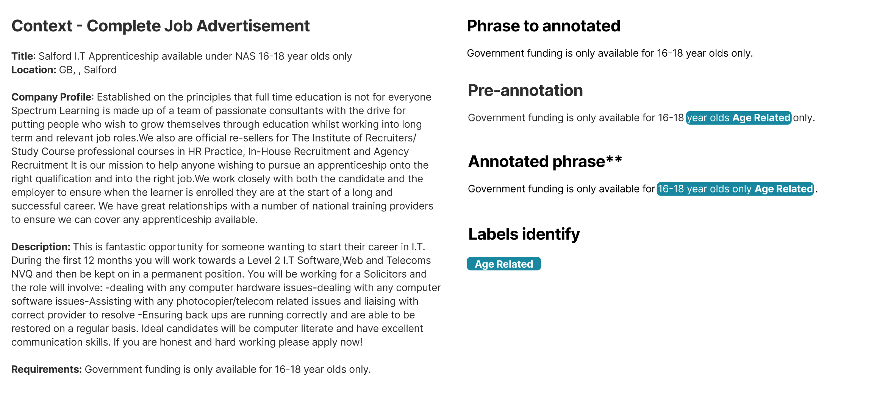

# Job Ads Bias Annotation Guide

By Martín Bórquez & Marcelo Mendoza

This guide provides instructions for annotators to identify and label different types of bias in job advertisements. Its objective is to produce a high-quality, consistent dataset that encompasses both explicit and implicit biases. Annotators should adhere to the definitions and examples in this guide to maintain uniformity throughout the dataset.

This document defines and establishes the specific criteria for classifying various bias types in job advertisements. It supports the master’s thesis entitled “Detection and Classification of Bias in Job Advertisement Using Machine Learning”.

# Introduction

Job advertisement biases encompass any linguistic expressions within recruitment texts that can influence the perception of job opportunities based on characteristics such as gender, age, ethnicity, religion, or disability. These biases may manifest explicitly through overt statements (or group mentions) or implicitly via subtle language cues that, often unintentionally, favor or disadvantage certain groups.

This annotation guide is designed to create a **token-level annotated corpus that captures both explicit and implicit biases in job advertisements**. The resulting dataset will enhance Named Entity Recognition (NER) models, enabling them to detect nuanced bias signals that go beyond conventional keyword spotting. By annotating biases at both the word and span levels, this project aims to provide deeper insights into how specific lexical choices shape candidate perceptions and affect recruitment outcomes.

**Annotation Process Overview**

Prior to manual annotation, real job advertisements were processed using specialized lexicons to generate a word-level pre-annotation of bias. This pre-annotation covers 11 of the 13 identified bias categories but remains incomplete because it does not account for sentence structure or contextual meaning.

A key contribution expected from human annotators is the ability to discern bias based on context and appropriate spans. To facilitate this, annotators will receive complete job ads and be asked to examine specific sentences within each ad, allowing them to evaluate language in its full context.

The items to be annotated will consist of individual words or contiguous word spans extracted from real job advertisements. These advertisements originate from a diverse dataset encompassing multiple countries and industries.

In this work, bias is conceptualized as any language choice in a job advertisement that significantly affects its perception by individuals or groups, depending on their protected attributes. Such biases can either enhance or diminish the appeal or sense of belonging for the individual or group to a certain job. Other researchers address the idea that language-based biases can occur without overt or intentional discrimination, while some bias might discourage certain groups but not necessarily translate directly into illegal or explicit discriminatory practices (Heilman, 2012; Gaucher et al., 2011). Therefore, bias in this context can be unconscious and does not always imply discrimination, as their effect varies depending on the recipient and the specific circumstances of the bias.
